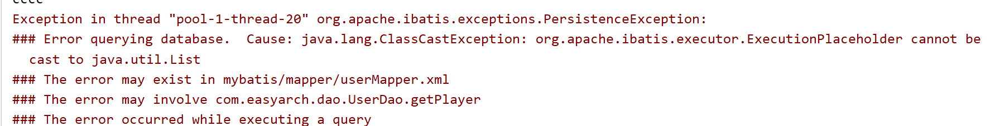
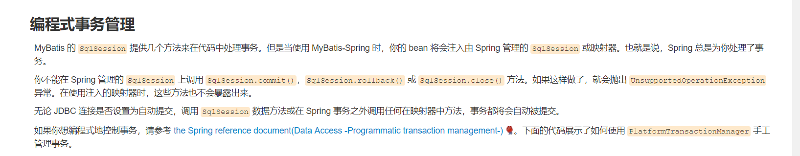
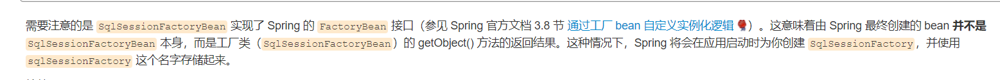
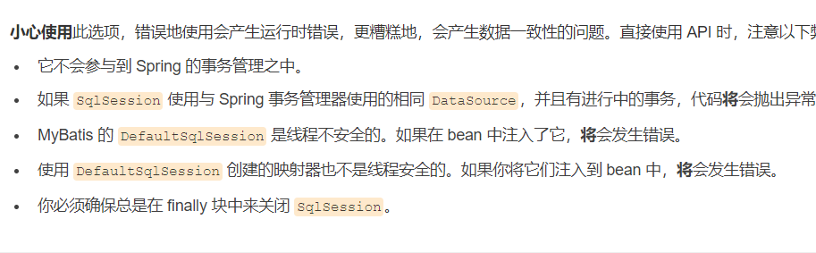

## mybatis
* 遇到问题
* mybatis想用xml的形式，又想让spring托管。
发现了并发安全的问题
 
 * 查阅相关资料后发现，如果想让spring托管，必须使用SqlsessionFactoryBean，而不可以使用SqlSessonFactory，
  
  
 * 官方文档显示
 * 使用 MyBatis-Spring，你可以继续直接使用 MyBatis 的 API。只需简单地使用 SqlSessionFactoryBean 在 Spring 中创建一个 SqlSessionFactory，然后按你的方式在代码中使用工厂即可。
 ```
public class UserDaoImpl implements UserDao {
  // SqlSessionFactory 一般会由 SqlSessionDaoSupport 进行设置
    private final SqlSessionFactory sqlSessionFactory;

    public UserDaoImpl(SqlSessionFactory sqlSessionFactory) {
    this.sqlSessionFactory = sqlSessionFactory;
    }

    public User getUser(String userId) {
    // 注意对标准 MyBatis API 的使用 - 手工打开和关闭 session
        try (SqlSession session = sqlSessionFactory.openSession()) {
        return session.selectOne("org.mybatis.spring.sample.mapper.UserMapper.getUser", userId);
    }
  }
}
 ```
 然后官方文档已经给出了明确的提示了。。。看来要好好优化代码选择使用方式
    映射器非线程安全！
   
   
   
  
  ###解决中。。。
  
  * 方法一，抛弃xml，直接用接口注入的方式写，注意要用到mybatis-spring包以及用SqlSessionFactory创建工厂
  * 方法二，全都用xml配置，总之，不要混搭